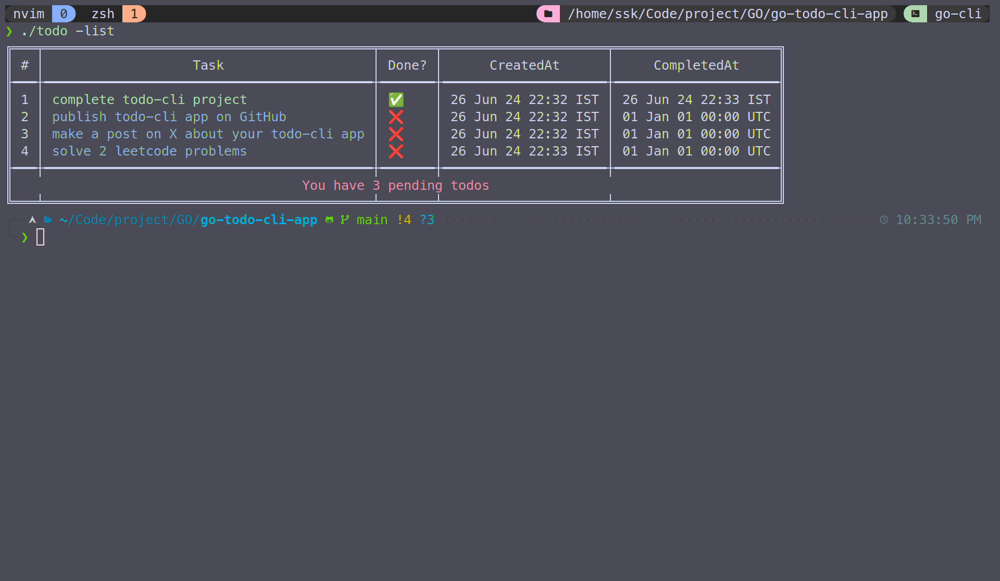

# Go Todo CLI App

A simple command-line todo application written in Go. This app allows you to add, complete, delete, and list todo tasks with a user-friendly, color-coded output.

## Features

- **Add a new todo**: Easily add new tasks.
- **Complete a todo**: Mark tasks as completed.
- **Delete a todo**: Remove tasks from your list.
- **List todos**: View all tasks with color-coded status indicators.
- **Persistent storage**: Todos are saved in a JSON file.

## Preview

Check out the video preview of the Go Todo CLI App in action:



## Installation

1. Clone the repository:

   ```sh
   git clone https://github.com/yourusername/go-todo-cli-app.git
   cd go-todo-cli-app
   ```

2. Build the application:
   ```sh
   go build -o todo cmd/todo/main.go
   ```

## Usage

### Add a new todo

```sh
./todo -add "Your new task"
```

### Complete a todo

```sh
./todo -complete=[task_number]
```

### Delete a todo

```sh
./todo -del=[task_number]
```

### Example

```sh
./todo -add "Buy groceries"
./todo -add "Do laundry"
./todo -list
./todo -complete=1
./todo -list
./todo -del=2
./todo -list
```

### Author

- 2SSK
